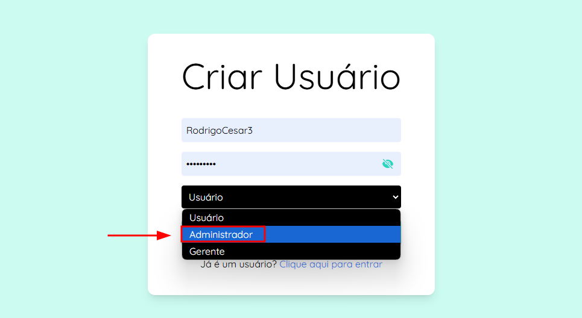
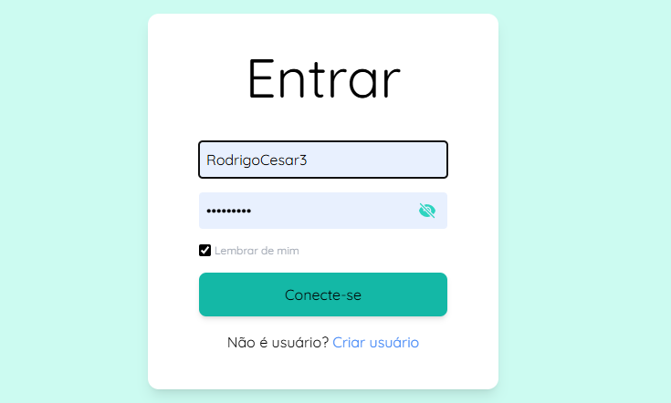

<h1 align="left">Sistema Agrix - Gerenciamento de Fazendas 🌾</h1>

###

  

###

O sistema Agrix foi pensado em trazer facilidade para testar a API Agrix e trazer um layout interativo. Ele é dividido em três roles: <strong>admin</strong>, <strong>manager</strong> e <strong>user</strong>. Cada papel pode ser testado de forma prática e interativa, com acessos e permissões diferentes. 
 
Fique à vontade para testar acessando: <a href="https://agrix-front-end.vercel.app/">https://agrix-front-end.vercel.app/</a>.

###

<h2 align="left">🚀 Stacks utilizadas</h2>

###

  
  
  
  
  

###

<h2 align="left">🛠️ Como utilizar</h2>

  
<strong>👤 Crie um usuário</strong>

  

    
  

  
Obs: se quiser ter acesso a todas as funcionalidades, escolha o papel "administrador".

  
<strong>🔑 Faça Login</strong>

  

    
  

### 🗂️ Navegação por Roles

  
<strong>👑 Admin</strong>

  
Como administrador, você tem acesso completo ao sistema. Pode realizar as seguintes ações:

  <ul>
    <li>🌱 <strong>Gerenciar fazendas:</strong> Crie, edite e exclua fazendas associadas a usuários.</li>
    <li>🌾 <strong>Gerenciar plantações:</strong> Crie, edite e exclua plantações associadas às fazendas.</li>
    <li>🧪 <strong>Gerenciar fertilizantes:</strong> Associe fertilizantes às plantações. Lembre-se de que fertilizantes associados a plantações não podem ser excluídos.</li>
    <li>🔧 <strong>Controle completo:</strong> Edite e exclua qualquer item no sistema.</li>
  </ul>

  
<strong>🛡️ Gerente</strong>

  
Como gerente, você tem permissões intermediárias no sistema. Pode realizar as seguintes ações:

  <ul>
    <li>🌱 <strong>Gerenciar fazendas:</strong> Crie, edite e exclua fazendas associadas a usuários.</li>
    <li>🌾 <strong>Gerenciar plantações:</strong> Crie, edite e exclua plantações associadas às fazendas.</li>
    <li>🚫 <strong>Restrição:</strong> Não é permitido criar, editar ou excluir fertilizantes.</li>
  </ul>

  
<strong>👥 Usuário</strong>

  
Como usuário, você tem permissões limitadas e pode realizar as seguintes ações:

  <ul>
    <li>👁️ <strong>Listar fazendas:</strong> Veja apenas as fazendas que estão associadas ao seu perfil.</li>
    <li>🌾 <strong>Gerenciar plantações:</strong> Crie plantações associadas às suas próprias fazendas.</li>
    <li>🧪 <strong>Listar fertilizantes:</strong> Consulte a lista de fertilizantes disponíveis.</li>
    <li>🔒 <strong>Restrição:</strong> Você não pode criar ou gerenciar fazendas. Para isso, entre em contato com um administrador ou gerente.</li>
  </ul>

### 🔗 Saiba mais sobre o Back-end

Para saber mais sobre o back-end do projeto Agrix, acesse o repositório:  
[https://github.com/Christofani/projeto-agrix](https://github.com/Christofani/projeto-agrix)

---

## 💖 Agradecimentos

Obrigado por conferir o projeto Agrix! Para facilitar a interação com a API, foi criado um front-end intuitivo e funcional que permite testar as funcionalidades do sistema de forma prática.  

Qualquer dúvida ou sugestão será bem-vinda!

**Autor**: [Rodrigo Cesar Christofani Junior](https://github.com/Christofani)
